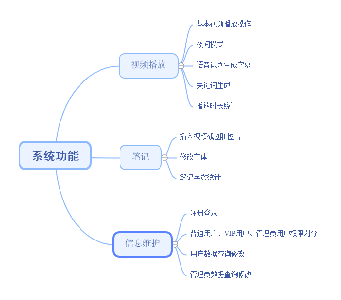
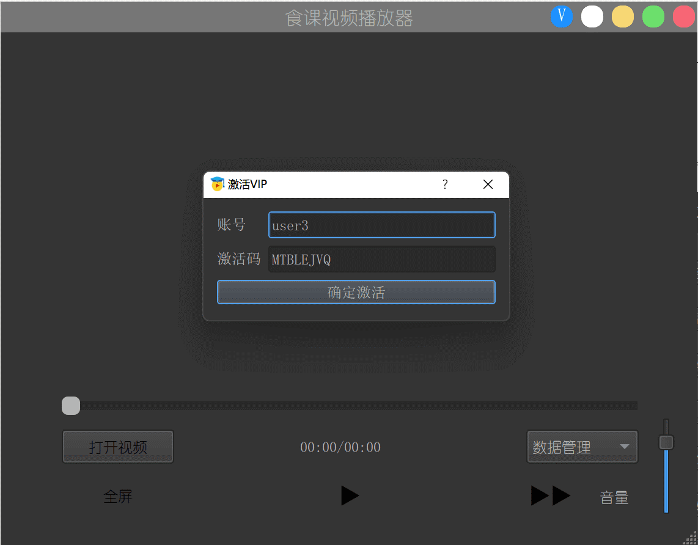
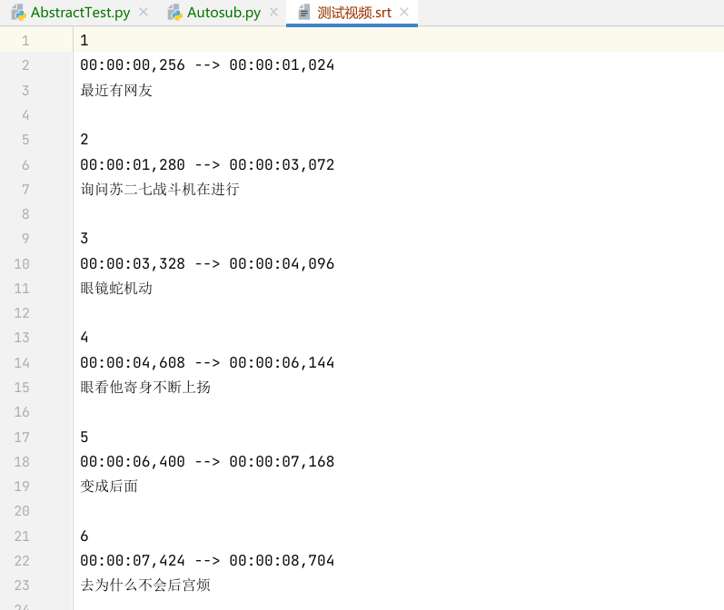
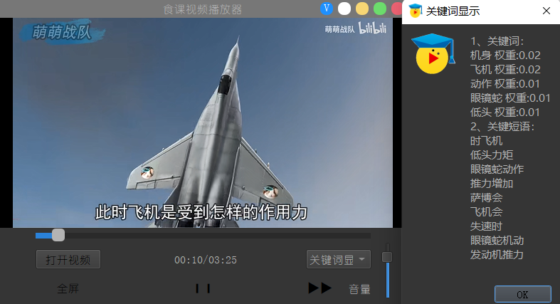
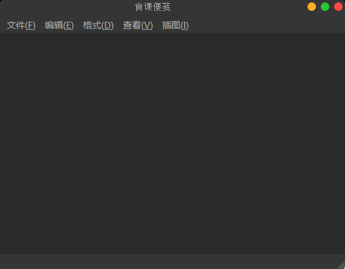
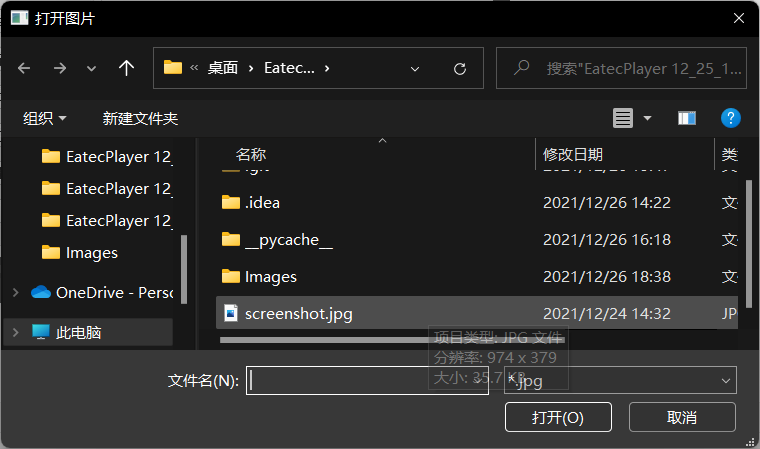
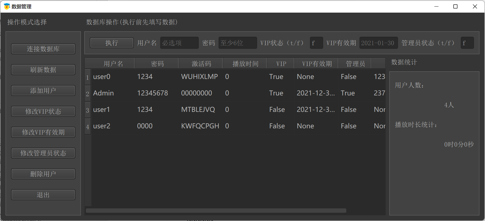
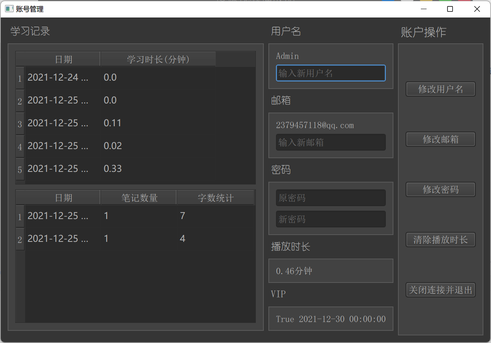

# EatecPlayer——A multifunctional video player based on PyQt5(食课——基于PyQt5的多功能视频播放器)

## 项目介绍

这是一个基于Python语言编写的多功能视频播放器，采用了流行的可视化工具PyQt5进行开发。我们建立了一个多功能本地视频播放系统，主要由四大部分组成：

1. 视频播放器的主窗体
2. 富文本便笺
3. 显示账户信息和统计数据的管理界面
4. openGauss 数据库

## 运行环境及其开发工具

该软件系统在Windows10 操作系统下进行开发。软件开发环境为 Python3.8，开发工具为 PyCharm，数据库为 openGauss。所有数据都通过 JDBC 连 接 openGauss 数据库进行操作。

|          |             |
| ------- | ----------- |
| 操作系统    | Windows10   |
| 编程语言    | Python(3.8) |
| IDE     | PyCharm     |
| 数据库     | openGauss   |
| 数据库连接工具 | JDBC        |


## 项目功能

1. 用户注册登录，添加普通用户、VIP 用户以及管理员用户，分别给予不同权限。 
2. 本地视频播放器，包括播放暂停、控制进度、控制音量、开启全屏等。 
3. 视频同步笔记，可以导入视频截图和外部图片，修改笔记字体等。 
4. 视频播放和笔记数据统计，以及账户信息管理与显示。 
5. 语音识别生成视频字幕和生成字幕关键词

**系统功能结构图**如下所示：

#### 

## 项目特点

1. 我们的项目完善了`大`多数视频播放器的开源代码的痛点：如完美解决了涉及**信号槽函数**的功能——进度条可以**自由拖动控制视频进度**，可以**拖动音量条调节音量**
2. 我们吸取了较多代码的优点，并融入了自己的功能特色，从**视频播放、笔记功能、信息维护**三个维度进行功能拓展
3. 作为大二本科生的一项软件课程设计项目，我们按照**软件工程**的流程，采用敏捷开发的方式，在实现原型后进行快速迭代更新功能。我们也给出了产品分析与设计报告（共计61页），可见所附[项目报告](./report/EatecPlayer Report.pdf)

## 项目使用

在使用该项目文件前，请确保您已成功安装**ImageMagick Display和ffmpeg**并配置**环境变量**，并且需要**安装LAV解码器**以实现视频播放器功能，若您不清楚，可以查看该[技术博客](https://blog.csdn.net/u012552296/article/details/84311042)

1. 设计数据库的相关操作由于需要**设定的数据库进行连接，因此需要简要修改**，否则可能提示数据库连接失败，从而无法正常进行数据管理。
2. 准备就绪，选择合适的解释器(我们建议使用PyCharm的虚拟环境)，在Terminal(终端)处输入

```python
pip install -r requirements.txt
```

安装项目所需包后，选择 [EatecPlayer.py](./EatecPlayer.py) 启动，即可进行视频播放

## Requirements.txt

```
JayDeBeApi==1.2.3
progressbar33==2.4
PyQt5==5.15.6
pysrt==1.1.2
pywin32==228
qtmodern==0.2.0
textrank4zh==0.3
win32gui==221.6
progressbar
```

## 实例展示([点此视频展示](https://b23.tv/1JGjWC8))

下面是该软件的部分功能截图，详细功能可参考所附[项目报告](./report/EatecPlayer Report.pdf)

1. 开始界面，右上角按钮依次为“激活VIP“、”切换日/夜间模式“”最小化“”最大化“”关闭“，您也可以将鼠标在按钮处**悬浮2秒显示按钮信息**



2. 所有**功能拓展都在右下角的【工具栏】按钮处实现**。您可以在打开本地视频后双击视频或点击最大化按钮进行全屏观看


3. 通过调用Autosub.py进行**语音转字幕**



4.通过选择工具栏的**关键词显示功能**，生成从字幕得到的关键词，算法是TextRank，类似于谷歌搜索的PageRank算法。


5.选择工具栏的**食课便笺**，进行笔记



插入图片，可以使用快捷键`Crlt+Shift+I`，插入本地图片可以使用快捷键`Crlt+I`，在播放视频后可以快捷插入视频截图

6. **数据管理界面**



7. **账户管理界面**

 连接数据库后，可以进行账户管理

1. 显示统计和清除的播放本地视频的时长数据
2. 显示所做笔记的数据的相关信息
3. 提供修改密码、用户名等基本信息操作



## 开源协议

本项目遵守开源协议GPL

## 鸣谢

本项目受到多个开源项目的启发，特此鸣谢

我们团队凭借该项目，参与了全国电子商务大赛，荣获**浙江省二等奖**

## 相关链接

1. [个人博客](https://shawnpi233.github.io/)
2. [【食课——基于PyQt5的视频播放器（软件课程设计）-哔哩哔哩】](https://b23.tv/1JGjWC8)
